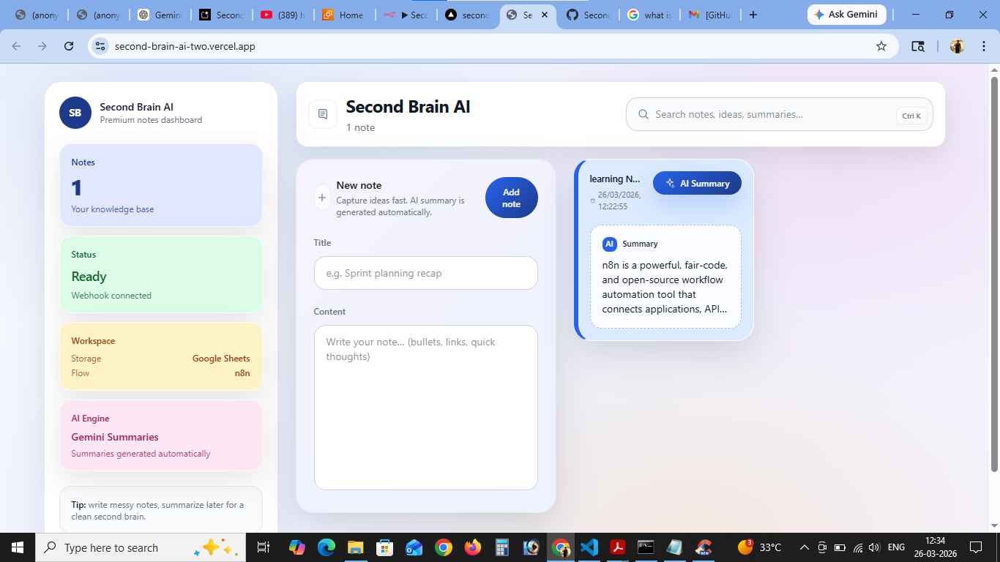

# Second Brain AI 🧠

Second Brain AI is an AI-powered note intelligence application that helps users capture, organize, and retrieve thoughts through an automated cloud workflow.
The frontend is built with React + Vite, while automation, AI processing, and note persistence are handled through n8n workflows connected to Google Sheets.

## 🚀 Live Demo

🔗 https://second-brain-ai-two.vercel.app



## ✨ Features

* Smart note creation through a clean UI
* AI-assisted note understanding
* Cloud-synced storage using Google Sheets
* n8n automation-based backend logic
* Fast frontend deployment with Vercel
* Category and priority based note handling
* Structured response returned instantly to UI

## 🛠 Tech Stack

### Frontend

* React
* Vite
* Tailwind CSS

### Automation / Backend Logic

* n8n Webhook Workflows

### Storage

* Google Sheets

### Deployment

* Vercel

## 🧩 Architecture Overview

Frontend sends structured note data to n8n webhook.

Flow:

1. User creates note in frontend

2. Frontend sends:

   * user_input
   * timestamp
   * category
   * source

3. n8n processes request

4. Google Sheets stores note

5. AI response returns to frontend

6. UI updates instantly

## 📂 Project Structure

```text
Second-Brain-AI/
│
├── frontend/
│   ├── src/
│   ├── public/
│   ├── components/
│   ├── hooks/
│   └── package.json
│
├── vercel.json
└── README.md
```

## ⚙️ Local Setup

Clone repository:

```bash
git clone https://github.com/Ajay-paka/Second-Brain-AI.git
cd Second-Brain-AI/frontend
```

Install dependencies:

```bash
npm install
```

Create environment file:

```bash
copy .env.example .env
```

Add webhook URL:

```bash
VITE_N8N_WEBHOOK_URL=your_n8n_webhook_url
```

Run project:

```bash
npm run dev
```

## 🌐 Deployment

This project is configured for frontend-only deployment on Vercel.

## 📌 Google Sheets Expected Fields

* id
* user_input
* category
* priority
* timestamp
* ai_response

## 🔮 Future Improvements

* AI semantic search
* Note update/delete workflows
* Cloud sync reliability improvements
* Multi-workflow architecture
* Voice note support
* AI summary engine

## 👨‍💻 Author

Ajay Paka

GitHub: https://github.com/Ajay-paka
